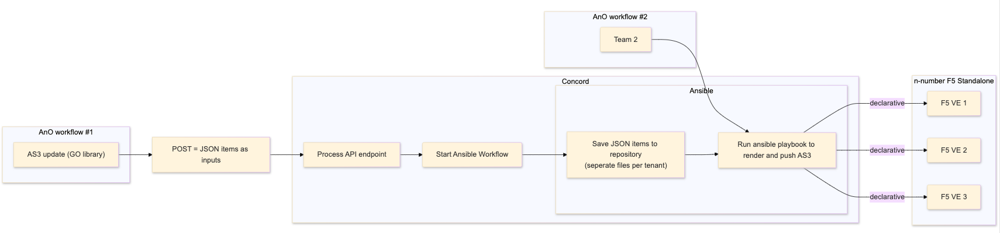
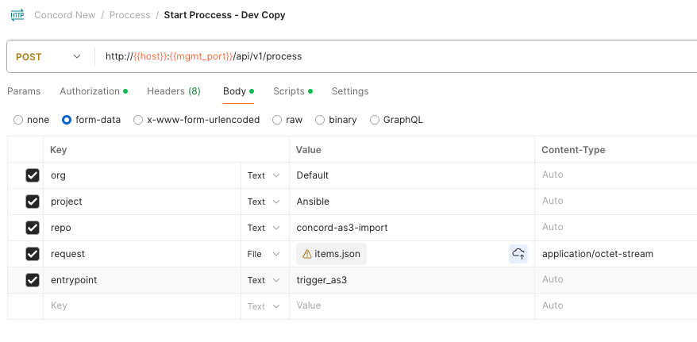
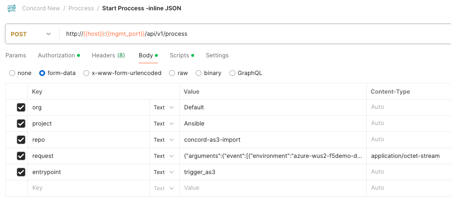

# concord-as3-import



### Project Goals
|  | Done | 
| :------ | :------ | 
| 1. Receive JSON items from a POST request | X |  
| 2. Save JSON items to per-tenant files into a github repository | X | 
| 3. Create new tag in github for a new candidate configuration version | X | 
| 4. Identify what tenants had configuration changed | X | 
| 5. Run a jinja2 template to generate the AS3 schema for the tenants that changed | X | 
| 6. Push the AS3 JSON schema to n-number F5 VE | X |
| 7. Test multiple POST request in parallel | In-Progress |  


### Example calling Concord Proccess with JSON items (file upload)
cURL:
```bash
curl -v -H "Authorization: $token" -F “request=@items.json” -F entrypoint=trigger_as3 -F org=Default -F project=Ansible -F repo=concord-as3-import  http://concord:80/api/v1/process
```
  
Postman


Subtitute your values for:
```
org: "Default"
project: "Ansible"
repo: "concord-as3-import"
request: @items.json
entrypoint: "trigger_as3"
```

In order to pass the AS3 declaration to ansible via the Concord Proccess using this flow, add the `argument` and `event` keys to your JSON items. Concord variable `event` is mapped to ansible variable `as3_inputs`. See example [items.json](https://github.com/megamattzilla/concord-as3-import/blob/main/items.json). 
  
Otherwise give your paramiter a different name such as `items.json: @items.json` which will create the resulting file `items.json` in the workspace folder, which ansible can then reference. 

### Example calling Concord Proccess with JSON items (inline)
cURL:
```bash
curl -v -H "Authorization: $token" -F request='{"arguments":{"event":[{"environment":"azure-wus2-f5demo-dev-A","versionTag":"8.0.0","tenant":"example1","virtuals":[{"virtual":"example1","virtualAddresses":"10.0.1.10","virtualPort":80,"type":"Service_TCP","profileTCP":"f5-tcp-progressive","pool_members":["10.0.1.100","10.0.1.101"],"servicePort":80,"monitorType":"https","snat":["10.0.1.10"]},{"virtual":"example3","virtualAddresses":"10.0.3.10","virtualPort":80,"type":"Service_TCP","profileTCP":"f5-tcp-progressive","pool_members":["10.0.3.100","10.0.3.101"],"servicePort":80,"monitorType":"https","snat":["10.0.3.10"]}]},{"environment":"azure-wus2-f5demo-dev-A","versionTag":"8.0.0","tenant":"example2","virtuals":[{"virtual":"example2","virtualAddresses":"10.0.2.10","virtualPort":80,"type":"Service_TCP","profileTCP":"f5-tcp-progressive","pool_members":["10.0.2.100","10.0.2.101"],"servicePort":80,"monitorType":"tcp","snat":["10.0.2.10"]}]}]}};type=application/octet-stream' -F entrypoint=trigger_as3 -F org=Default -F project=Ansible -F repo=concord-as3-import  http://concord:80/api/v1/process
```
  
Postman


In order to pass the AS3 declaration to ansible via the Concord Proccess using this flow, add the `argument` and `event` keys to your JSON items. Concord variable `event` is mapped to ansible variable `as3_inputs`. See example [items.json](https://github.com/megamattzilla/concord-as3-import/blob/main/items.json). 